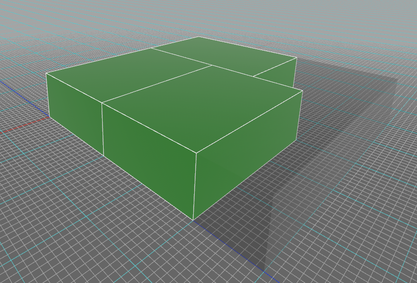

# packer-3d
> Rust Crate for 3-dimensional packing of boxes optimally along x, y or z, or all three axis.


*Example of what you can make*

## Quickstart
```
$ cargo add packer-3d
```
OR place this under `[dependencies]` in `Cargo.toml`
```
packer-3d = "0.1.0"
```

## Example
After adding the dependency, you can test it with this example:
```rust
use packer_3d::{
    PackerInstance,
    sorting::Sorting,
    box3d::Box3D,
    vector3d::Vector3D
};

fn main() {
    let mut my_boxes = vec![
        Box3D::from_xyz_whl(0,0,0,100,200,300,1,0),
        Box3D::from_xyz_whl(0,0,0,100,200,300,2,0),
        Box3D::from_xyz_whl(0,0,0,100,200,300,3,0)
    ];
    
    // Create our packer instance
    let mut my_instance = PackerInstance::new(
        &mut my_boxes, // Our boxes
        Vector3D::new(500, 0, 500), // Our container size
        true, // Allow rotations
        (false, true, false), // Minimize height only
        &Sorting::descending_volume // Our initial sorting heuristic
    );
    
    // Pack all 3 boxes
    for _ in 0..3 {
        my_instance.pack_next();
    }

    println!("{:#?}", my_instance.boxes);
}
```
Which should output:
```
[
    Box3D {
        position: Vector3D {
            x: 0,
            y: 0,
            z: 0,
        },
        size: Vector3D {
            x: 300,
            y: 100,
            z: 200,
        },
        id: 1,
        origin: 0,
    },
    Box3D {
        position: Vector3D {
            x: 300,
            y: 0,
            z: 0,
        },
        size: Vector3D {
            x: 200,
            y: 100,
            z: 300,
        },
        id: 2,
        origin: 0,
    },
    Box3D {
        position: Vector3D {
            x: 0,
            y: 0,
            z: 200,
        },
        size: Vector3D {
            x: 300,
            y: 100,
            z: 200,
        },
        id: 3,
        origin: 0,
    },
]
```
Visualized this gives:
