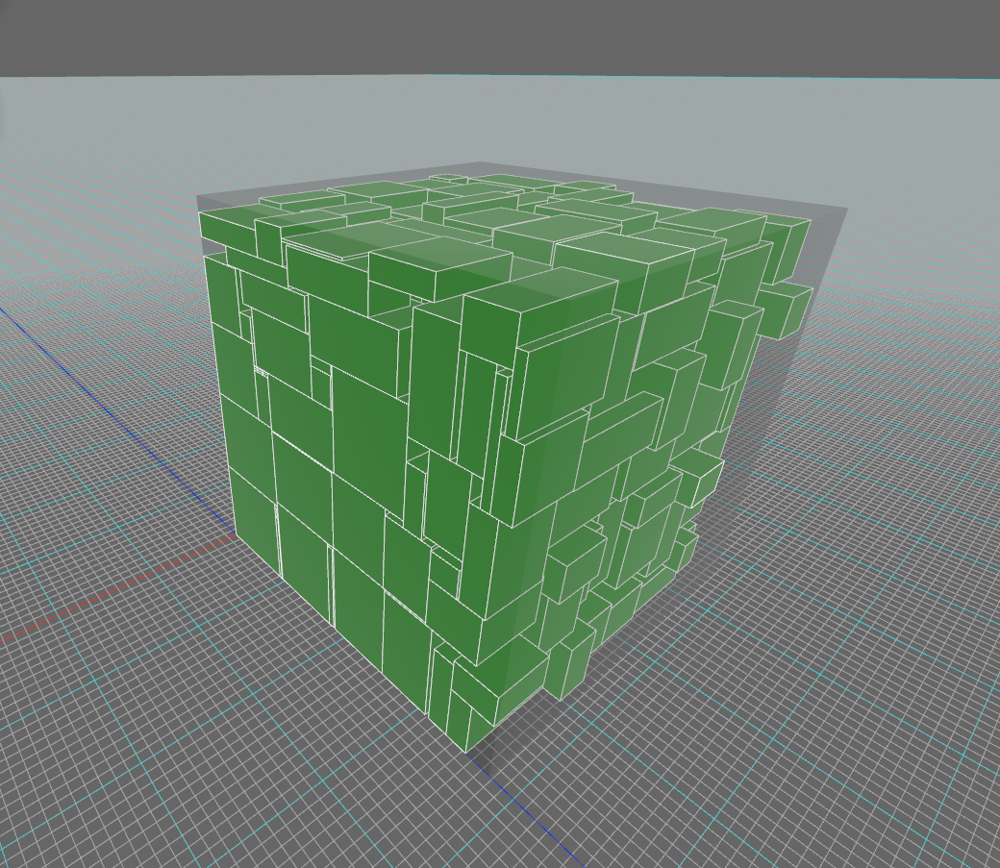

# packer-3d
> Rust Crate for 3-dimensional packing of boxes optimally along x, y or z, or all three axis.


*Example of what you can make*

## Quickstart
```
$ cargo add packer-3d
```
OR place this under `[dependencies]` in `Cargo.toml`
```
packer-3d = "0.1.0"
```